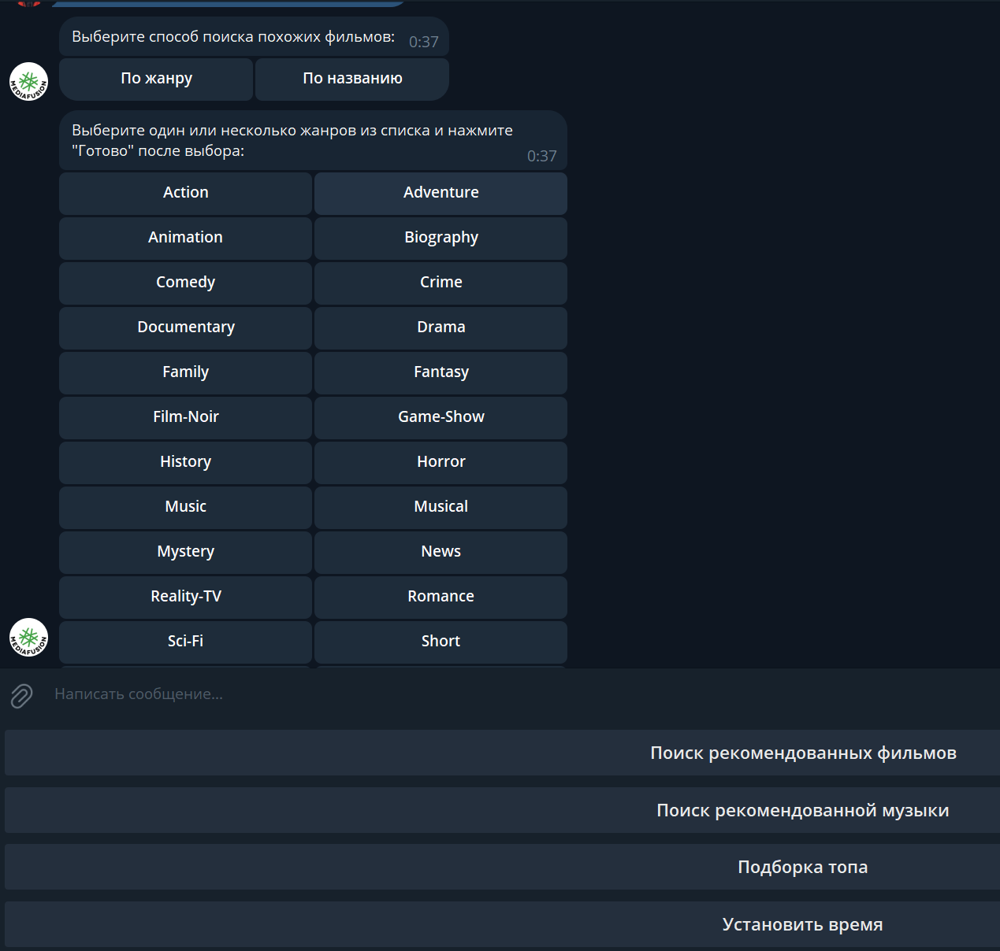
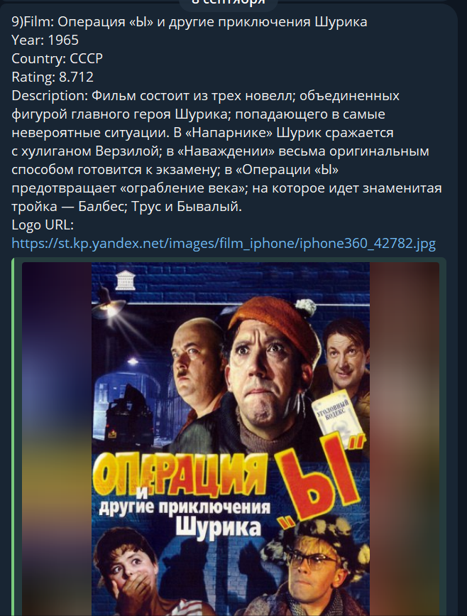
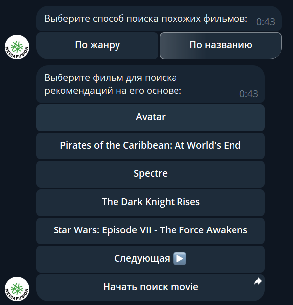
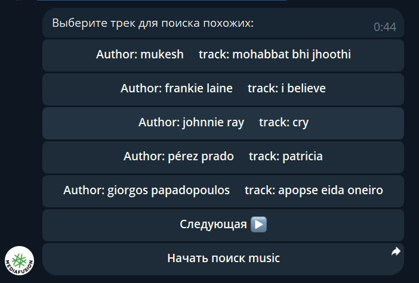

# Media Bot 🎵🎬

Telegram-бот для рекомендаций и поиска музыки и фильмов.

## Описание 📖

Этот бот позволяет пользователям искать музыку и фильмы, получать рекомендации и топ 10 композиций или фильмов с разных сайтов, а также устанавливать напоминания. Проект написан на Python с использованием библиотеки `telebot` и базы данных PostgreSQL.

## Функциональность 🔍

- **Аутентификация**: Пользовательская регистрация и вход.
- **Рекомендации**: Получение рекомендаций музыки и фильмов на основе метода knn.
- **Напоминания**: Функционал для напоминаний о работе бота.
- **Топ выбора**: Пользователь может просматривать топовые треки по жанрам, годам.

## Структура проекта 📂

Проект организован в несколько модулей:

- **`src/`**: Основная папка с файлами бота.
  - **`database/`**: Логика взаимодействия с базой данных.
  - **`function/`**: Основные функции бота, такие как напоминания и рекомендации.
  - **`utils/`**: Вспомогательные функции и утилиты для работы бота.

- **`data/`**: Данные, используемые ботом.
- **`.env`**: Переменные окружения (например, ключи API).
- **`Dockerfile`** и **`docker-compose.yaml`**: Настройка для контейнеризации проекта.
- **`requirements.txt`**: Зависимости Python для проекта.

## Установка и запуск 🚀

1. **Клонируйте репозиторий**:

    ```bash
    git clone https://github.com/LuckyAm20/MediaBot.git
    cd MediaBot
    ```

2. **Создайте и настройте `.env` файл**. Используйте пример `example_env` и заполните его своими данными.

3. **Сборка и запуск Docker контейнеров**:

    ```bash
    docker-compose up --build
    ```

4. **Запустите бота**:

    Бот будет доступен через Telegram. Используйте предоставленный токен для запуска.

## Скриншоты работы бота 📸


<div style="display: flex; justify-content: space-between; flex-wrap: wrap;">
  
  
  
  
  
</div>


## Используемые технологии 🛠️

- Python
- Telegram API (`telebot`)
- PostgreSQL
- Docker и Docker Compose


## © Лицензия

Этот проект распространяется под лицензией MIT. Подробнее см. файл [LICENSE](LICENSE).

## 👨‍💻 Автор

- [Aptukov Mikhail - github](https://github.com/LuckyAm20)